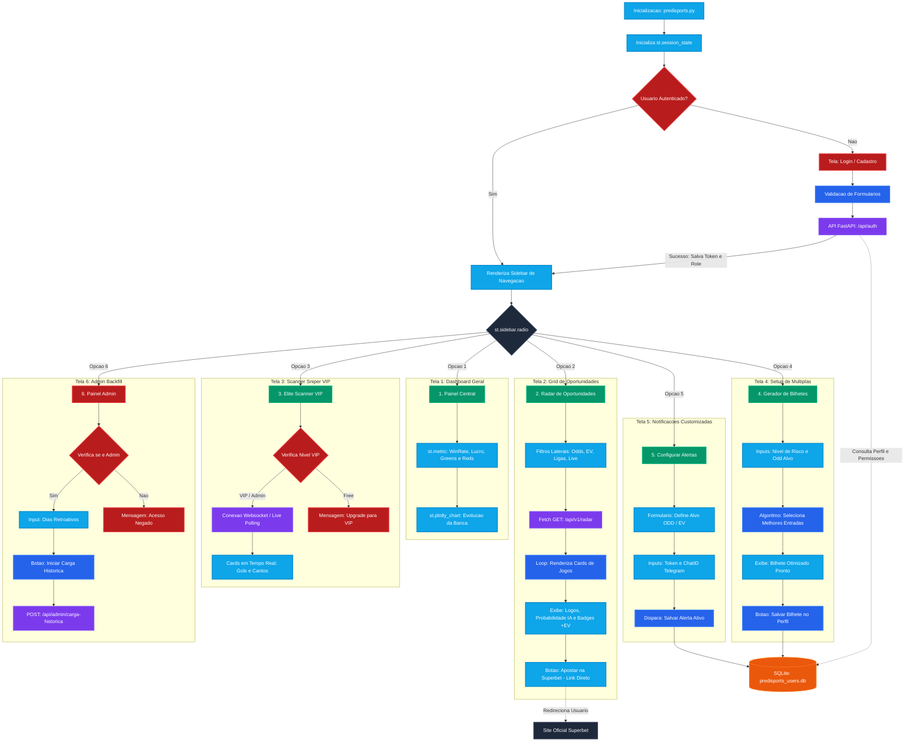

# Pipeline de Previsão de Resultados de Futebol

Este repositório contém um pipeline de Machine Learning de ponta a ponta, projetado para treinar modelos, realizar previsões e prever resultados de partidas de futebol. O sistema é modular, configurável e utiliza técnicas de ensemble learning para melhorar a precisão das previsões.

## Tabela de Conteúdos
- [Visão Geral](#visão-geral)
- [Funcionalidades](#funcionalidades)
- [Estrutura do Projeto](#estrutura-do-projeto)
- [Arquitetura do Sistema](#️-arquitetura-do-sistema)
- [Pré-requisitos](#pré-requisitos)
- [Instalação](#instalação)
- [Configuração](#configuração)
- [Como Usar](#como-usar)
  - [Treinamento dos Modelos](#treinamento-dos-modelos)
  - [Realização de Previsões](#realização-de-previsões)
  - [Combinação dos Resultados](#combinação-dos-resultados)
  - [Execução do Pipeline Completo](#execução-do-pipeline-completo)
- [Detalhes do Pipeline](#detalhes-do-pipeline)
  - [Fluxo de Treinamento](#fluxo-de-treinamento)
  - [Fluxo de Previsão](#fluxo-de-previsão)
  - [Combinação e Enriquecimento](#combinação-e-enriquecimento)

---

## Visão Geral

O pipeline é construído em torno de uma classe `ModelPipeline` que gerencia o ciclo de vida de três modelos distintos:
1.  **`home_goals`**: Previsão do número de gols do time da casa.
2.  **`away_goals`**: Previsão do número de gols do time visitante.
3.  **`match_outcome`**: Previsão do resultado da partida (geralmente uma representação numérica).

Ele utiliza um `StackingRegressor` para combinar as previsões de múltiplos estimadores, visando um resultado mais robusto. O processo inclui pré-processamento de dados, engenharia de features, seleção de features e persistência de artefatos (modelo, scaler, etc.) para uso posterior.

## Funcionalidades

- **Múltiplos Modelos**: Treina e gerencia modelos independentes para diferentes alvos de previsão.
- **Ensemble Learning**: Utiliza `StackingRegressor` com `RandomForestRegressor` e `LinearRegression` como estimadores base e `Ridge` como estimador final.
- **Engenharia de Features**: Aplica `PolynomialFeatures` para capturar interações complexas entre as variáveis.
- **Seleção de Features**: Emprega `Recursive Feature Elimination (RFE)` para selecionar as features mais impactantes.
- **Interface de Linha de Comando**: Controlado via argumentos (`train`, `predict`, `combine`, `full_pipeline`) para facilitar a orquestração.
- **Persistência de Artefatos**: Salva e carrega modelos treinados e transformadores de dados (`StandardScaler`, `RFE`, `PolynomialFeatures`) usando `joblib`.
- **Enriquecimento de Dados**: Conecta-se a um banco de dados MongoDB para enriquecer as previsões finais com dados adicionais da partida (nomes dos times, liga, odds, etc.).
- **Logging Detalhado**: Gera logs para cada etapa do processo, facilitando o debug e monitoramento.

## Estrutura do Projeto

O script espera a seguinte estrutura de diretórios para funcionar corretamente. Certifique-se de criá-los na raiz do seu projeto.

```
/
├── data/
│   ├── model_data_training_newPoisson.xlsx   # Dados para treinamento
│   └── merged_data_prediction.csv        # Novos dados para predição
│
├── log/                                      # Diretório para arquivos de log
│   ├── pipeline_home_goals.log
│   └── ...
│
├── models/                                   # Diretório para artefatos salvos
│   ├── model_stacked_home_goals.pkl
│   ├── scaler_home_goals.pkl
│   └── ...
│
├── made_predictions/                         # Diretório para os resultados
│   ├── predictions_home_goals.xlsx
│   ├── predictions_final_combined.xlsx
│   └── ...
│
└── pipeline.py                               # O script principal
```

## 🏗️ Arquitetura do Sistema

O fluxo de dados e operações segue a seguinte arquitetura:



## Pré-requisitos

- Python 3.8+
- MongoDB (opcional, para a etapa de combinação de resultados)

## Instalação

1.  Clone este repositório:
    ```bash
    git clone <url-do-repositorio>
    cd <nome-do-repositorio>
    ```

2.  Crie um ambiente virtual (recomendado):
    ```bash
    python -m venv venv
    source venv/bin/activate  # No Windows: venv\Scripts\activate
    ```

3.  Instale as dependências:
    ```bash
    pip install pandas numpy scikit-learn pymongo joblib openpyxl
    ```

## Configuração

Todas as configurações principais estão centralizadas no dicionário `CONFIG` no início do script. Antes de executar, ajuste os seguintes parâmetros conforme necessário:

- **Caminhos de Diretórios**: `model_dir`, `log_dir`, `prediction_dir`, `data_dir`.
- **Arquivos de Dados**: `training_data_path` e `prediction_input_path`.
- **Conexão com o MongoDB**: `mongo_uri` e `mongo_db`.
- **Listas de Colunas**: `cols_to_drop_training` e `cols_to_drop_prediction` para ajustar as features usadas no treinamento e na previsão.

## Como Usar

O pipeline é executado a partir da linha de comando, especificando a ação desejada.

### Treinamento dos Modelos

Este comando treinará os três modelos (`home_goals`, `away_goals`, `match_outcome`) usando os dados de `training_data_path` e salvará os artefatos (modelo, scaler, etc.) no diretório `models/`.

```bash
python pipeline.py train
```

### Realização de Previsões

Após o treinamento, use este comando para gerar previsões para novos dados localizados em `prediction_input_path`. Ele carregará os artefatos salvos, processará os novos dados e salvará um arquivo Excel para cada tipo de modelo no diretório `made_predictions/`.

```bash
python pipeline.py predict
```
**Nota:** É necessário ter executado o `train` pelo menos uma vez antes de rodar o `predict`.

### Combinação dos Resultados

Este comando lê os arquivos de previsão individuais gerados pela etapa `predict`, os combina em um único DataFrame usando a coluna `running_id` e, em seguida, enriquece esses dados com informações do MongoDB. O resultado final é salvo como `predictions_final_combined.xlsx`.

```bash
python pipeline.py combine
```

### Execução do Pipeline Completo

Para conveniência, este comando executa todas as etapas em sequência: treina todos os modelos, realiza as previsões e combina os resultados.

```bash
python pipeline.py full_pipeline
```

## Detalhes do Pipeline

### Fluxo de Treinamento

O método `train()` da classe `ModelPipeline` segue os seguintes passos:
1.  **Carregamento e Limpeza**: Carrega os dados de treinamento, remove valores infinitos, filtra outliers (gols entre 0 e 6) e remove colunas desnecessárias.
2.  **Seleção de Features Numéricas**: Identifica e isola as colunas numéricas para processamento matemático.
3.  **Engenharia de Features**: Gera features polinomiais de grau 2 para capturar interações não lineares.
4.  **Divisão de Dados**: Utiliza `KFold` para dividir os dados em dois conjuntos, permitindo um treinamento sequencial (fit em um fold, e re-fit no outro).
5.  **Padronização (Scaling)**: Aplica `StandardScaler` para normalizar a escala das features.
6.  **Seleção de Features (RFE)**: Usa um `DecisionTreeRegressor` como estimador base para o `RFE` selecionar 80% das features mais relevantes.
7.  **Treinamento do Modelo**: Instancia e treina o `StackingRegressor`.
8.  **Salvamento de Artefatos**: Persiste o modelo treinado, o scaler, o seletor RFE e o transformador polinomial em arquivos `.pkl`.

### Fluxo de Previsão

O método `predict()` orquestra a geração de previsões:
1.  **Carregamento de Artefatos**: Carrega os arquivos `.pkl` salvos durante o treinamento.
2.  **Carregamento de Novos Dados**: Lê o arquivo CSV/Excel com os dados para previsão.
3.  **Pré-processamento**: Aplica as **mesmas transformações** ajustadas no treinamento aos novos dados, na mesma ordem:
    - Geração de features polinomiais (`poly.transform`).
    - Padronização (`scaler.transform`).
    - Seleção de features (`selector.transform`).
4.  **Previsão**: Utiliza o modelo carregado (`model.predict()`) para gerar os valores previstos.
5.  **Salvamento dos Resultados**: Cria um DataFrame com as previsões e o `running_id` correspondente, salvando-o em um arquivo Excel.

### Combinação e Enriquecimento

A função `combine_predictions()` finaliza o processo:
1.  **Agregação**: Lê os arquivos de previsão individuais (`predictions_home_goals.xlsx`, etc.) e os une em um único DataFrame.
2.  **Consulta ao MongoDB**: Conecta-se ao MongoDB e busca dados contextuais (times, liga, odds) para os `running_id` presentes no DataFrame agregado.
3.  **Enriquecimento**: Mescla os dados do MongoDB com os dados de previsão.
4.  **Pós-processamento**: Arredonda os valores de gols previstos para o inteiro mais próximo e cria uma coluna `Prediction_models` no formato `X-Y`.
5.  **Exportação Final**: Salva o DataFrame final e enriquecido em `predictions_final_combined.xlsx`.
